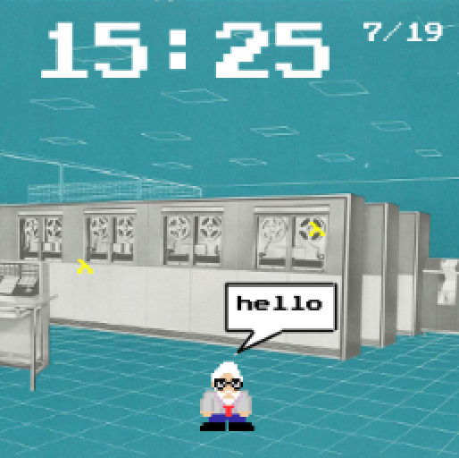

## THE GAME

Not really a game but an ambient experience hence the clock so you can run it all day! Starring John McCarthy in his favorite place: the machine room!

Features:
* runs on desktop and mobile (read: Clojure and ClojureScript)
* halo of Lambdas
* speech bubbles
* boredom detection and animation
* game logic is coded in McCarthy's minimal Lisp as featured in his 1960 paper *Recursive Functions of Symbolic Expressions and Their Computation by Machine*
* eventually to be a watchface which is why the screen is square

Obviously a work in progress.

## BUILD

`build-cljs-autobuild.sh`

`build-clj.sh`

## RUN

`start-app.sh` runs the Clojure application.

## DEBUG

`debug-app.sh`

In emacs fun `cider-connect` and point it to port 4006

## TODO

* add Atari style maze
* use simple physics from here https://www.toptal.com/game/ultimate-guide-to-processing-simple-game

## Collisions

Collisions are calculated!  I'm surprised there is no bit-for-bit detection of collisions, the C64 had it built-in and that was forever ago.

Only 1 game used background color to determine collisions, and it was a slow as when I tried it.

Collisions are easily calculated for round things, simple geometry.

For fast games, they use a model of the world and render based on it.  Almost all of the screen is broken up into blocks (like 20x20) and its easy to tell if your hero is touching one of the 20x20 blocks just 625 combinations on a 500px screen.

Perhaps use the best of both worlds, use the mccarthy-animation-mapper to blob up the screen using 20x20 blocks and not a 920x500 pixel array which is a data nightmare. 
